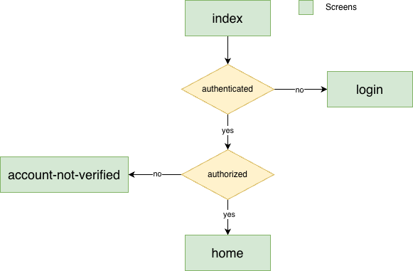

# Welcome to your Expo app 👋

This is an [Expo](https://expo.dev) project created with [`create-expo-app`](https://www.npmjs.com/package/create-expo-app).

## Get started

1. Install dependencies

   ```bash
   npm install
   ```

2. Start the app

   ```bash
   npx expo start
   ```

In the output, you'll find options to open the app in a

- [development build](https://docs.expo.dev/develop/development-builds/introduction/)
- [Android emulator](https://docs.expo.dev/workflow/android-studio-emulator/)
- [iOS simulator](https://docs.expo.dev/workflow/ios-simulator/)
- [Expo Go](https://expo.dev/go), a limited sandbox for trying out app development with Expo

You can start developing by editing the files inside the **app** directory. This project uses [file-based routing](https://docs.expo.dev/router/introduction).

## Setting Up Screen

This part shows how to configure each screen in order to make them consistently like

### Using the MainView

Each screen must contain the MainView component like:

```html
<MainView headerShown={true} loading={false}>
   ...
</MainView>
```

Where basically the MainView must receive the param:

- headerShown(bool): To describe if the screen will have a header or not. According to this param, it will create a main container using the right space considering the safe area or not.
- loading(bool): To describe if the screen is loading something. If it's true, it will display a loading modal


### Setting up the useHeaderBehavior

Here we will describe all the configuration that our header should have

```tsx
const screenConf: ScreenConf = {
   headerShown: false
};
useHeaderBehavior({
   headerShown: bool, # Show the header or not
   iconName: string, # Set the right icon to use. This will hide the left back icon
   onPressIconName: func, # When the right icon is pressed
   loading: bool, # It will hide all the header icons
});
```

### Complete example

```tsx
import { useHeaderBehavior } from "@/hooks/header-behavior";
import { ScreenConf } from "@/types/screen-conf";
import { useState } from "react";
import MainView from "@/components/MainView";

export default function ExampleScreen() {

  const screenConf: ScreenConf = {
    headerShown: true
  };

  useHeaderBehavior({ headerShown: screenConf.headerShown })

  const [loading, setLoading] = useState(false);

  return (
    <MainView headerShown={screenConf.headerShown} loading={loading}>
      <>
    </MainView>
  )
}
```

## Login flow



### How the Authentication Flow Works

The authentication flow is handled in `app/index.tsx` and works as follows:

1. **Initial State**: The app starts with `initializing = true` while Firebase connects.

2. **Auth State Listener**: On mount, `onAuthStateChanged()` listens for authentication state changes:
   ```tsx
   useEffect(() => {
     const subscriber = onAuthStateChanged(auth, handleAuthStateChanged);
     return subscriber; // unsubscribe on unmount
   }, []);
   ```

3. **User State Handler**: When auth state changes, the app:
   - Sets the user in Crashlytics if authenticated (`setUserId()`)
   - Updates local user state
   - Sets `initializing = false`

4. **Navigation Logic**: Once initialization completes, the app routes based on authentication status:
   ```tsx
   useEffect(() => {
     if(!initializing){
       if(isAuthenticated()){           // User logged in?
         if(isAuthorized()){             // Email verified?
           router.replace('/(auth)/home');
         }else{
           router.replace('/(auth)/account-not-verified');
         }
       }else{                            // Not logged in
         router.replace('/login');
       }
     }
   }, [initializing]);
   ```

5. **Three Possible Routes**:
   - **Not Authenticated** → `/login` - User must sign in
   - **Authenticated but Not Verified** → `/(auth)/account-not-verified` - Email verification required
   - **Authenticated and Verified** → `/(auth)/home` - Full access granted

**Key Functions**:
- `isAuthenticated()`: Returns `true` if user exists
- `isAuthorized()`: Returns `true` if user exists AND email is verified (`user.emailVerified`)


## Using the Alert Component

The `Alert` component is a custom modal dialog that supports dark/light themes and flexible button layouts.

### Basic Usage

```tsx
import { Alert } from '@/components/Alert';
import { PrincipalButton } from '@/components/Buttons';
import { useState } from 'react';

function MyComponent() {
  const [alertVisible, setAlertVisible] = useState(false);

  return (
    <>
      <PrincipalButton 
        title="Show Alert" 
        onPress={() => setAlertVisible(true)} 
      />

      <Alert
        visible={alertVisible}
        title="Alert Title"
        message="This is the alert message"
        onClose={() => setAlertVisible(false)}
        rightButton={
          <PrincipalButton 
            title="OK" 
            onPress={() => setAlertVisible(false)} 
          />
        }
      />
    </>
  );
}
```

### Props

- **visible** (required): `boolean` - Controls whether the alert is shown
- **title**: `string` - Optional title displayed at the top
- **message**: `string` - Optional message text below the title
- **onClose**: `() => void` - Callback when the backdrop is pressed
- **onOutsidePress**: `() => void` - Additional callback when pressing outside the alert
- **leftButton**: `React.ReactNode` - Optional button on the left side
- **rightButton**: `React.ReactNode` - Optional button on the right side

### Two-Button Layout

```tsx
<Alert
  visible={confirmVisible}
  title="Confirm Action"
  message="Are you sure you want to proceed?"
  onClose={() => setConfirmVisible(false)}
  leftButton={
    <SecondaryButton 
      title="Cancel" 
      onPress={() => setConfirmVisible(false)} 
    />
  }
  rightButton={
    <PrincipalButton 
      title="Confirm" 
      onPress={handleConfirm} 
    />
  }
/>
```

### Features

- Automatically themed for dark/light mode
- Backdrop dismissal support
- Centered modal with max 80% screen width
- Flexible button layout (one or two buttons)
- Touch events properly handled to prevent backdrop dismissal when pressing the alert content


## Using Firebase with the app models

This section explains the standardized pattern for handling data structures between the application and Firebase. Each model follows a consistent structure to ensure type safety and maintainability.

### Pattern Overview

Each data model consists of two main parts:

1. **Type Definition** - Defines the shape of data used within the app
2. **Factory Object** - Provides methods for data transformation

### Example: UserSettings Model

Located in `models/UserSettings.tsx`:

```tsx
export type UserSettingsData = {
  defaultCurrency: string;
};

type UserSettingsFactory = {
  initToApp: () => UserSettingsData;
  toApp: (data: any) => UserSettingsData;
  toFirebase: (data: UserSettingsData) => any;
};

export const UserSettingsFactory: UserSettingsFactory = {
  initToApp: function(): UserSettingsData {
    return {
      defaultCurrency: 'USD',
    };
  },
  toApp: function(data: any): UserSettingsData {
    return {
      defaultCurrency: data.defaultCurrency
    };
  },
  toFirebase: function(data: UserSettingsData): any {
    return {
      defaultCurrency: data.defaultCurrency
    };
  }
};
```

### The Three Factory Methods

#### 1. `initToApp(): ModelData`

**Purpose**: Creates a new instance with default values.

**When to use**:
- Initializing new user accounts
- Resetting data to defaults
- Creating placeholder instances

```tsx
const newSettings = UserSettingsFactory.initToApp();
// Returns: { defaultCurrency: 'USD' }
```

#### 2. `toApp(data: any): ModelData`

**Purpose**: Transforms Firebase data into app format.

**When to use**:
- After fetching data from Firebase
- Receiving data from external sources

```tsx
const firebaseData = { defaultCurrency: 'EUR' };
const appData = UserSettingsFactory.toApp(firebaseData);
// Returns typed UserSettingsData
```

**Best practices**:
- Handle missing fields gracefully
- Convert Firebase types (Timestamp → Date)
- Provide defaults for undefined values

#### 3. `toFirebase(data: ModelData): any`

**Purpose**: Transforms app data into Firebase-compatible format.

**When to use**:
- Before saving to Firebase
- Before updating Firebase documents

```tsx
const appData: UserSettingsData = { defaultCurrency: 'GBP' };
const firebaseData = UserSettingsFactory.toFirebase(appData);
// Returns object ready for Firebase
```

### Complete Usage Example

#### Fetching from Firebase

```tsx
import { UserSettingsFactory } from '@/models/UserSettings';
import { doc, getDoc } from 'firebase/firestore';
import { db } from '@/firebase';

async function fetchUserSettings(userId: string) {
  const docRef = doc(db, 'user_settings', userId);
  const docSnap = await getDoc(docRef);
  
  if (docSnap.exists()) {
    // Transform Firebase data to app format
    const settings = UserSettingsFactory.toApp(docSnap.data());
    return settings;
  } else {
    // Return defaults for new users
    return UserSettingsFactory.initToApp();
  }
}
```

#### Saving to Firebase

```tsx
import { UserSettingsFactory, UserSettingsData } from '@/models/UserSettings';
import { doc, setDoc } from 'firebase/firestore';
import { db } from '@/firebase';

async function saveUserSettings(userId: string, settings: UserSettingsData) {
  const docRef = doc(db, 'user_settings', userId);
  
  // Transform app data to Firebase format
  const firebaseData = UserSettingsFactory.toFirebase(settings);
  await setDoc(docRef, firebaseData);
}
```

### Creating a New Model

Follow this template when creating new models in the `models/` directory:

```tsx
// models/Transaction.tsx

export type TransactionData = {
  id: string;
  amount: number;
  currency: string;
  description: string;
  date: Date;
  category: string;
};

type TransactionFactory = {
  initToApp: () => TransactionData;
  toApp: (data: any) => TransactionData;
  toFirebase: (data: TransactionData) => any;
};

export const TransactionFactory: TransactionFactory = {
  initToApp: function(): TransactionData {
    return {
      id: '',
      amount: 0,
      currency: 'USD',
      description: '',
      date: new Date(),
      category: 'uncategorized',
    };
  },
  
  toApp: function(data: any): TransactionData {
    return {
      id: data.id || '',
      amount: data.amount || 0,
      currency: data.currency || 'USD',
      description: data.description || '',
      // Convert Firebase Timestamp to Date
      date: data.date?.toDate() || new Date(),
      category: data.category || 'uncategorized',
    };
  },
  
  toFirebase: function(data: TransactionData): any {
    return {
      id: data.id,
      amount: data.amount,
      currency: data.currency,
      description: data.description,
      // Convert Date to Firebase Timestamp
      date: Timestamp.fromDate(data.date),
      category: data.category,
    };
  }
};
```